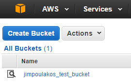

## Introduction

Before we get starting building full applications using Terraform, we have some things that we need to set up in order to verify that we have everything that we need.

> As a sidenote, this series of tutorials requires at least a small amount of knowledge of Terraform.

#### Table of Contents

1. [Terraform](#terraform)
2. [AWS CLI](#aws-cli)
3. [Your First Provisioning](#your-first-provisioning)

#### Terraform

You can grab the Terraform executable at their download page: [https://www.terraform.io/downloads.html](https://www.terraform.io/downloads.html).

You should make sure that the executable is on your `$PATH` if you are on Windows, or in `/usr/bin` if you are on a Linux/Mac.

You can verify that Terraform is installed properly by opening a terminal and running this command:

```bash
terraform -version
```

#### AWS CLI

Another thing that you should install is the AWS CLI from their download page: [http://docs.aws.amazon.com/cli/latest/userguide/installing.html](http://docs.aws.amazon.com/cli/latest/userguide/installing.html)

You can verify that AWS CLI is installed properly by opening a terminal and running this command:

```bash
aws --version
```

You will want to run the AWS CLI configuration tool with the following command:

```bash
aws configure
```

It will ask for your access key, secret key, region, and preferred output format. The reason we use this is so that we don't accidentally put our credentials into a repository. We want to avoid that as much as possible.

#### Your First Provisioning

Pull this terraform training repo to a location on your local workstation.

If you look in 1-introduction directory, there are two Terraform files:

```
0.variables.tf
1.main.tf
```

The `variables` file contains variable declarations and defaults, while the `main` file contains our basic deployment.

In order to test that everything is working as intended, we are going to create an S3 bucket. We aren't going to put anything in it, but we are going to verify that our script has created this bucket correctly.

You will want to make some changes to your variables file in order to make sure that you can create this bucket correctly. Please change the bucket name to something that is unique, as AWS does not allow duplicate bucket names in S3.

Once you've done this, you should plan your deployment with this command:

```
terraform plan
```

You should see something like this as the output:

```
λ terraform plan
Refreshing Terraform state in-memory prior to plan...
The refreshed state will be used to calculate this plan, but
will not be persisted to local or remote state storage.


The Terraform execution plan has been generated and is shown below.
Resources are shown in alphabetical order for quick scanning. Green resources
will be created (or destroyed and then created if an existing resource
exists), yellow resources are being changed in-place, and red resources
will be destroyed. Cyan entries are data sources to be read.

Note: You didn't specify an "-out" parameter to save this plan, so when
"apply" is called, Terraform can't guarantee this is what will execute.

+ aws_s3_bucket.AwsBucket
    acceleration_status: "<computed>"
    acl:                 "private"
    arn:                 "<computed>"
    bucket:              "jimpoulakos_test_bucket"
    force_destroy:       "false"
    hosted_zone_id:      "<computed>"
    policy:              "<computed>"
    region:              "<computed>"
    request_payer:       "<computed>"
    tags.%:              "2"
    tags.Environment:    "demo"
    tags.Name:           "jimpoulakos_test_bucket"
    website_domain:      "<computed>"
    website_endpoint:    "<computed>"


Plan: 1 to add, 0 to change, 0 to destroy.
```

Planning allows you to see what Terraform plans to do before you apply those changes. This lets you verify that you have your dependencies created properly as well as make sure that you have something to verify against.

> One thing to note, you can create a plan that can be run at a later date with this command:
> 
> ```
> terraform plan -out=terraform.plan
> ```
> 
> This is pretty useful if you are developing some additional resources, but you need to deploy some portion first.

Once you confirm that this is what you want to provision, it's as simple as this command:

```
terraform apply
```

Which will have something similar to this output:

```
λ terraform apply
aws_s3_bucket.AwsBucket: Creating...
  acceleration_status: "" => "<computed>"
  acl:                 "" => "private"
  arn:                 "" => "<computed>"
  bucket:              "" => "jimpoulakos_test_bucket"
  force_destroy:       "" => "false"
  hosted_zone_id:      "" => "<computed>"
  policy:              "" => "<computed>"
  region:              "" => "<computed>"
  request_payer:       "" => "<computed>"
  tags.%:              "" => "2"
  tags.Environment:    "" => "demo"
  tags.Name:           "" => "jimpoulakos_test_bucket"
  website_domain:      "" => "<computed>"
  website_endpoint:    "" => "<computed>"
aws_s3_bucket.AwsBucket: Creation complete

Apply complete! Resources: 1 added, 0 changed, 0 destroyed.

The state of your infrastructure has been saved to the path
below. This state is required to modify and destroy your
infrastructure, so keep it safe. To inspect the complete state
use the `terraform show` command.

State path: terraform.tfstate
```

You can verify that this is the case by looking at your AWS console:



Finally, in order to clean up this tutorial, we are going to remove the resources we provisioned using Terraform:

```
λ terraform destroy
Do you really want to destroy?
  Terraform will delete all your managed infrastructure.
  There is no undo. Only 'yes' will be accepted to confirm.

  Enter a value:
```

Entering `yes` at the prompt will successfully delete the S3 bucket you just created.

```
  Enter a value: yes

aws_s3_bucket.AwsBucket: Refreshing state... (ID: jimpoulakos_test_bucket)
aws_s3_bucket.AwsBucket: Destroying...
aws_s3_bucket.AwsBucket: Destruction complete

Destroy complete! Resources: 1 destroyed.
```

#### State Files

One thing you will notice is that you have two files in your directory now:

* `terraform.tfstate`
* `terraform.tfstate.backup`

These files are **crucial** to your ability to deploy resources without accidentally messing things up, as well as maintain your resources. I have them ignored in this repository (in case you forked it) as they can contain credentials.

One thing to note is that if you use an automated system, you should store these state files in a secure location in order to be able to quickly make changes to your deployed resources. At this time, not everything can be successfully imported with Terraform, so having a valid state file is important to keeping things running smoothly.
