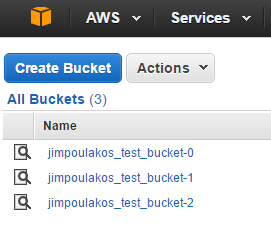

## Repeating

This tutorial will show you how to use Terraform's repeat functionality in order to make multiple items that share configuration. 

This is especially useful for things like creating multiple EC2 instances that share the same AMI, creating a series of Lambda Function shells, and other things.

#### Count and Indexes

If you look at the 1.main.tf file, you will notice the following changes:

<pre>
resource "aws_s3_bucket" "AwsBucket" {
    <b>count = 3</b>

    bucket = "${var.bucket["name"]}<b>-${count.index}</b>"
    acl = "${var.bucket["acl"]}"

    tags {
        Name = "${var.bucket["name"]}<b>-${count.index}</b>"
        Environment = "${var.bucket["environment"]}"
    }
}
</pre>

This allows us to create multiple copies of this S3 bucket from the previous example.

Plan this with `terraform plan` to see something like this:

```
+ aws_s3_bucket.AwsBucket.0                            
    acceleration_status: "<computed>"                  
    acl:                 "private"                     
    arn:                 "<computed>"                  
    bucket:              "jimpoulakos_test_bucket-0"   
    force_destroy:       "false"                       
    hosted_zone_id:      "<computed>"                  
    policy:              "<computed>"                  
    region:              "<computed>"                  
    request_payer:       "<computed>"                  
    tags.%:              "2"                           
    tags.Environment:    "demo"                        
    tags.Name:           "jimpoulakos_test_bucket-0"   
    website_domain:      "<computed>"                  
    website_endpoint:    "<computed>"                  
                                                       
+ aws_s3_bucket.AwsBucket.1                            
    acceleration_status: "<computed>"                  
    acl:                 "private"                     
    arn:                 "<computed>"                  
    bucket:              "jimpoulakos_test_bucket-1"   
    force_destroy:       "false"                       
    hosted_zone_id:      "<computed>"                  
    policy:              "<computed>"                  
    region:              "<computed>"                  
    request_payer:       "<computed>"                  
    tags.%:              "2"                           
    tags.Environment:    "demo"                        
    tags.Name:           "jimpoulakos_test_bucket-1"   
    website_domain:      "<computed>"                  
    website_endpoint:    "<computed>"                  
                                                       
+ aws_s3_bucket.AwsBucket.2                            
    acceleration_status: "<computed>"                  
    acl:                 "private"                     
    arn:                 "<computed>"                  
    bucket:              "jimpoulakos_test_bucket-2"   
    force_destroy:       "false"                       
    hosted_zone_id:      "<computed>"                  
    policy:              "<computed>"                  
    region:              "<computed>"                  
    request_payer:       "<computed>"                  
    tags.%:              "2"                           
    tags.Environment:    "demo"                        
    tags.Name:           "jimpoulakos_test_bucket-2"   
    website_domain:      "<computed>"                  
    website_endpoint:    "<computed>"                  
                                                       
                                                       
Plan: 3 to add, 0 to change, 0 to destroy.             
```

After running `terraform apply` you will be able to see these items in your AWS Console:



Finally, don't forget to remove these items with `terraform destroy`.
